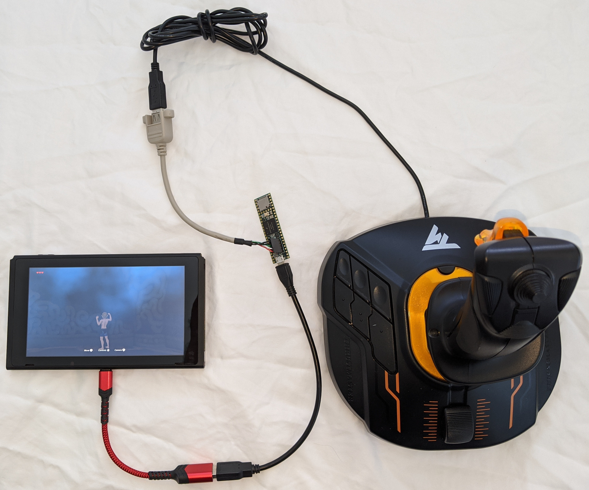
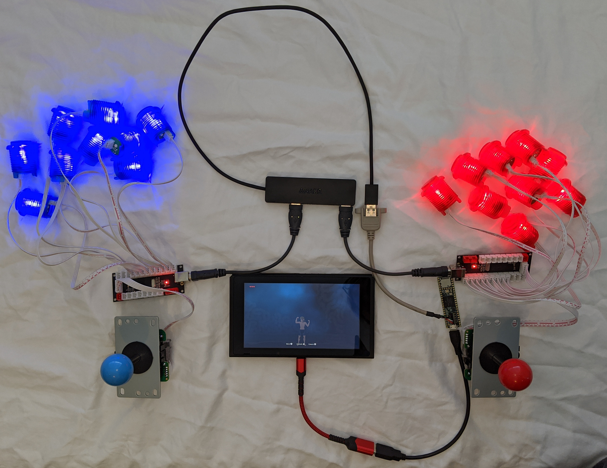
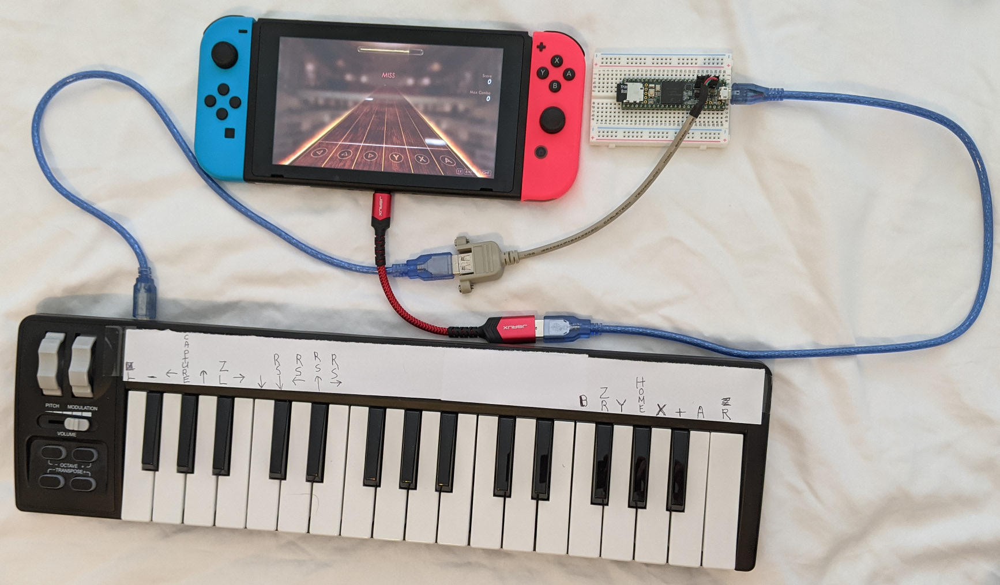

# Arduino NS Gamepad for Teensy
[](../../actions?query=workflow%3Abuild)

USB NS Gamepad provides a Nintendo Switch (NS) compatible gamepad. This is
useful for building an arcade console or to adapt other USB devices for use
with the NS.

This project adds USB HID flight sticks and gamepads to the USBHost_t36
library so they can be used with the NS.

```
	{ 0x0F0D, 0x00c1, HORIPAD, true},   // Hori Horipad NS compatible gamepad
	{ 0x0079, 0x0006, DRAGONRISE, true},// Dragon Rise Fightstick/joystick
	{ 0x046D, 0xC215, EXTREME3D, true}, // Logitech Extreme 3D Pro
	{ 0x044F, 0xB10A, T16000M, true}    // Thrustmaster T.16000M FCS
```

The Teensy 3.6/4.1 acts as a Teensy-in-the-middle between one or more game
controllers and the NS. This can be used for co-pilot mode as well as simulator
control panel/button boxes (car, truck, tractor, etc).

This project also provides additional USB device types for Teensy LC, 3.x and
4.x.

USB Joystick provides a generic joystick. This is known to work with
the Xbox Adaptive Controller (XAC). The XAC is confused by the extra
USB descriptors in the other Teensy USB Joystick types.

USB Serial + Joystick provides a generic joystick with CDC ACM USB serial.

This project has not had much testing so watch out for potholes.

If you prefer Python, see the Raspberry Pi version of NSGadget. The Pi has
enough GPIOs for NS buttons and the model B has 4 USB host ports. The Pi Zero
is the cheapest option but it is hard to find. See
https://github.com/gdsports/NSGadget_Pi.

## Install

Install the [Arduino IDE 1.8.19](https://www.arduino.cc/en/Main/Software) and
[Teensyduino 1.56](https://www.pjrc.com/teensy/td_156/). I highly
recommend extracting the IDE zip or tar in a separate directory from the
default Arduino directory.

On a Linux system, the following instructions will install the IDE into
`~/nsg/arduino-1.8.19`. Creating the portable directory ensures the sketches and
libraries are stored separately from the default Arduino sketches and
libraries.

```
cd
mkdir nsg
cd nsg
tar xf ~/Downloads/arduino-1.8.19-linux64.tar.xz
cd arduino-1.8.19
mkdir portable
```

Run the Teensyduino installer. Make sure to install in the arduino-1.8.19
directory created above.

Copy the files in this repo's hardware directory to the arduino-1.8.19/hardware
directory. This will overwrite Teensyduino files.

Start the IDE with all changes. The examples should build without changes. If
compile errors occur, be sure the Board is set to "Teensy 3.6" and the USB Type
is set to "NS Gamepad".

```
cd ~/nsg/arduino-1.8.19
./arduino&
```

## examples/NSGamepad

Teensy LC impersonates a USB NS Gamepad. This should also work on Teensy
3 and Teensy 4.

Select "NS Gamepad" from the "Tools > USB Type" menu.

Pushbuttons should be connected between the digital pins and ground.

For maximum compatibility with the NS, the USB serial and other USB endpoints
are not present. The USB descriptors are as much as possible same as the Hori
gamepad controller. One consequence is the Teensy auto upload does not work.
But this is easy to fix. Use the IDE Upload function. After the upload fails,
press the Prog button on the Teensy to start the upload.

Emulating an NS controller is not a new idea. Reverse engineering began as soon
as the console started shipping.

* https://github.com/dekuNukem/Nintendo_Switch_Reverse_Engineering
* https://github.com/progmem/Switch-Fightstick

Unlike the Xbox and PS, the NS does not do controller authentication so DIY
controllers are much easier to implement.

### Teensy LC pin out with button and axis assignments

For a graphic Teensy LC pin out diagram see the [following](https://www.pjrc.com/teensy/teensyLC.html).
Teensy 3.x/4.x should also work but the LC is sufficient.

|Function       |LC Pin |LC Pin |Function   |
|---------------|-------|-------|-----------|
|               |GND    |Vin    |           |
|RX1            |0      |GND    |           |
|TX1            |1      |3.3V   |           |
|Up             |2      |23/A9  |Y          |
|Right          |3      |22/A8  |B          |
|Down           |4      |21/A7  |A          |
|Left           |5      |20/A6  |X          |
|Left throttle  |6      |19/A5  |Right throttle|
|Left trigger   |7      |18/A4  |Right trigger|
|Minus          |8      |17/A3  |Left X axis|
|Left stick     |9      |16/A2  |Left Y axis|
|Capture        |10     |15/A1  |Right X axis|
|Home           |11     |14/A0  |Right Y axis|
|Plus           |12     |13     |Right stick|

Serial1 (RX1/TX1) pins are available for debug output.

For graphic joy-con diagrams see the [following](https://en-americas-support.nintendo.com/app/answers/detail/a_id/22634/~/joy-con-controller-diagram).

Note 1: The NS thumbsticks are clickable so they also count as buttons. See
"Left Stick" and "Right Stick" above.

Note 2: The direction buttons (Up, Right, Down, Left) are reported as an 8
direction D pad so some combinations cannot be reported.

## examples/NSPassthru

Teensy 3.6/4.1 USB NS gamepad pass through and conversion.

Select "NS Gamepad" from the "Tools > USB Type" menu.

This example contains proof of concept code for various modes of operation. All
USB controllers are active so the result is a kind of co-pilot mode. The NS
sees a single gamepad but two or more people can be using controllers. For
example, one person is driving with one controller while the other is aiming
and shooting using a different controller.

### Use flight control stick as a gamepad

Use one hand to control left and right sticks.
The hat switch at the top of the stick is mapped to the right thumbstick.
The big stick twist axis is also mapped to the right thumbstick X axis so it
can be used to look left and right.
A nice feature of the Thrustmaster T.16000M is it can be configured for left hand using a
screwdriver. See the [manual](http://ts.thrustmaster.com/download/accessories/manuals/T16000M/T16000M-User_manual.pdf) for details.

```
Nintendo Switch -- Teensy 3.6/4.1 -- Thrustmaster T.16000M Flight Stick
```



### Combine two arcade fight stick kits into one NS gamepad

Each fight stick kit has 9 buttons and 1 joystick (8 way switch). Find them by
searching ebay or Amazon for "arcade buttons stick kit". The USB encoder board
identifies itself as a Dragon Rise joystick. The boards are identical so the
convention is the first Dragon Rise board the sketch finds is assumed to be the
right side of the controller. The next board is the left side. Using blue
buttons for the left side and red buttons for the right continues the blue/red
joy-con theme.

```
Nintendo Switch -- Teensy 3.6/4.1 -- USB hub -- Dragon Rise
                                             -- Dragon Rise
```



### Gamepad macro recorder
Maybe someday use to record and play macros. Plug in a Hori Horipad game controller
and record the axis and button events to a file on the micro SD card.

### Button mapping from micro SD card
Maybe someday load button mappings from files on the microSD card.

```
Nintendo Switch -- Teensy 3.6/4.1 -- NS compatible gamepad such as Horipad
```

## examples/NSMIDI



The Teensy 3.6 converts MIDI note on/off from a MIDI device to Nintendo
Switch gamepad button presses/releases. The Switch is not modded or hacked.

Playing Pianista with a MIDI keyboard is lot more fun than using JoyCon
buttons.
