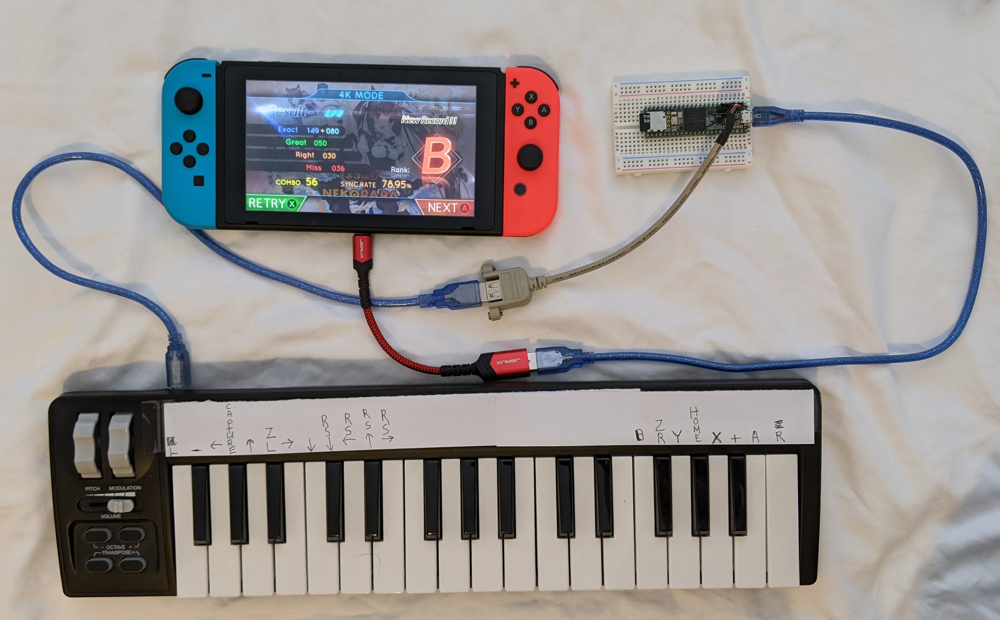

# MIDI Keyboard for Pianista and Musynx

The Teensy 3.6 converts MIDI note on/off from a MIDI device to Nintendo
Switch gamepad button presses/releases. The Switch is not modded or hacked.

The sketch contains support for a USB QWERTY keyboard but it is laggy compared
to a MIDI keyboard. This might be caused by my slow input response USB
keyboards.

