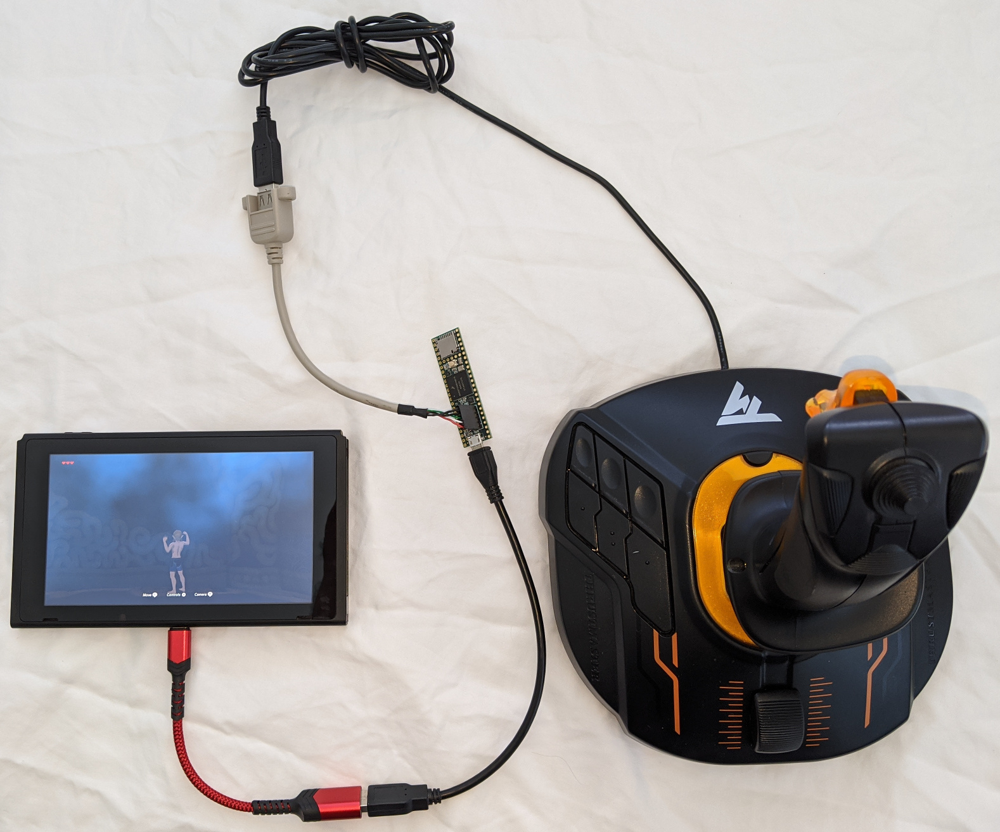
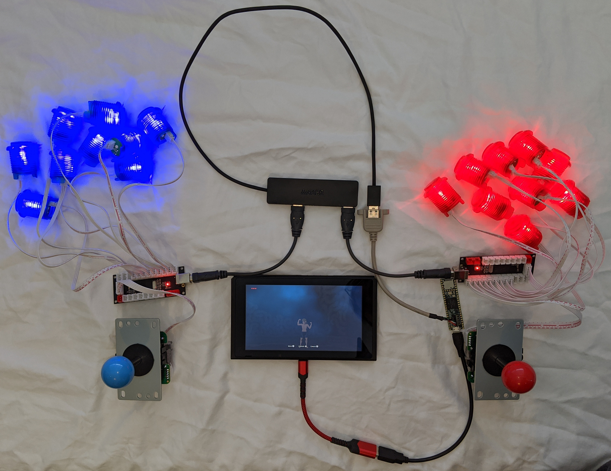

# NS Passthru

Teensy 3.6/4.1 USB NS gamepad pass through and conversion.

Select "NS Gamepad" from the "Tools > USB Type" menu.

This example contains proof of concept code for various modes of operation. All
USB controllers are active so the result is a kind of co-pilot mode. The NS
sees a single gamepad but two or more people can be using controllers. For
example, one person is driving with one controller while the other is aiming
and shooting using a different controller.

## Use flight control stick as a gamepad

Use one hand to control left and right sticks.
The hat switch at the top of the stick is mapped to the right thumbstick.
The big stick twist axis is also mapped to the right thumbstick X axis so it
can be used to look left and right.
A nice feature of the Thrustmaster T.16000M is it can be configured for left hand using a
screwdriver. See the [manual](http://ts.thrustmaster.com/download/accessories/manuals/T16000M/T16000M-User_manual.pdf) for details.

```
Nintendo Switch -- Teensy 3.6/4.1 -- Thrustmaster T.16000M Flight Stick
```



## Combine two arcade fight stick kits into one NS gamepad

Each fight stick kit has 9 buttons and 1 joystick (8 way switch). Find them by
searching ebay or Amazon for "arcade buttons stick kit". The USB encoder board
identifies itself as a Dragon Rise joystick. The boards are identical so the
convention is the first Dragon Rise board the sketch finds is assumed to be the
right side of the controller. The next board is the left side. Using blue
buttons for the left side and red buttons for the right continues the blue/red
joy-con theme.

```
Nintendo Switch -- Teensy 3.6/4.1 -- USB hub -- Dragon Rise
                                             -- Dragon Rise
```



## Gamepad macro recorder
Maybe someday use to record and play macros. Plug in a Hori Horipad game controller
and record the axis and button events to a file on the micro SD card.

## Button mapping from micro SD card
Maybe someday load button mappings from files on the microSD card.

```
Nintendo Switch -- Teensy 3.6/4.1 -- NS compatible gamepad such as Horipad
```
